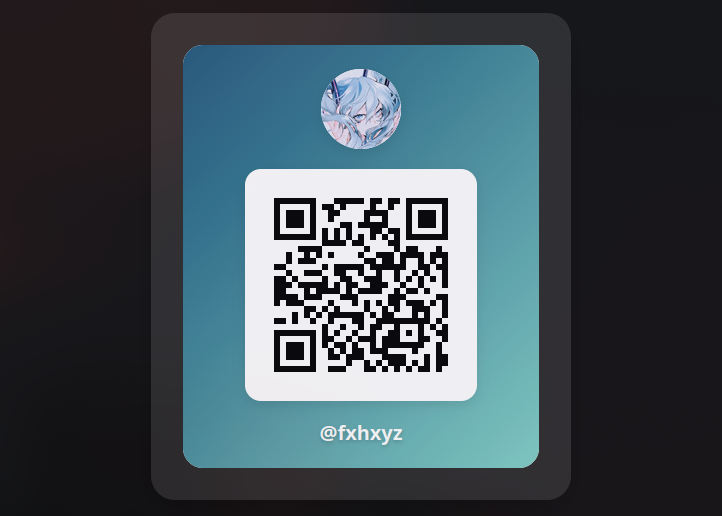

# 🎨 QR Code Creator

A modern, customizable QR code generator with avatars, gradients, animations, and persistent state — built with pure **HTML, CSS, and JavaScript**.

   

## ✨ Features

- 🔗 Generate QR codes from text or URLs
- 🎭 Avatar support:
  - Emoji mode
  - Image upload mode
- 🌈 20+ gradient background styles
- 💾 Automatic state persistence using `localStorage`
- 📥 Download QR code as PNG
- 🎬 Smooth UI animations powered by Animate.css
- ⚡ No frameworks, no build tools — pure frontend

---

## 🧪 Tech Stack

  

**Libraries & Tools:**
- **QRious** — QR code generation
- **Animate.css** — UI animations
- **modern-normalize** — consistent cross-browser styling

**Deployment:**
- 🚀 GitHub Pages


## 📸 Preview:



## 🚀 Live Demo:

#### 👉 https://fxhxyz4.github.io/qr/
#### 🛠️ How It Works:

- Enter text or a URL

- Set a username

- Choose an avatar:

- Emoji

- Uploaded image

- Pick a gradient background

- Download the generated QR code as PNG

### All settings are automatically saved in localStorage and restored on page reload.

## 📂 Project Structure:
```
├── index.html
├── main.css
├── index.js
├── img/
│   └── favicon.ico
└── README.md
```

#

## 📄 License: [MIT](./license.md)
